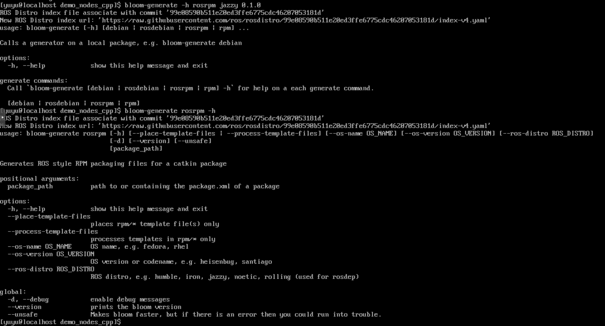

# Bloom 工具调研

## 什么是 Bloom

bloom 是一个用于打 deb 或者 rmp 的 ros 包的工具。开发者能够用这个工具为不同的操作系统打出不同 ros 版本的包。

## Bloom 的原理

> 根据元数据生成 .spec 

以下是一个完整的 ROS 软件源包：

bloom 会根据其中 `CMakelists.txt` `package.xml`，提取出相关的包名称、包版本、依赖关系
接着结合用户在指令中输入的操作系统、ROS 版本等信息开始启动整个构建过程

在运行 bloom-generate 的时候，还会基于上面获取到的信息开始读取 `rosrelease` 配置，比如说不同的发行版以及 ROS 版本需要 `rosrelease` 配置来进行定义。
`rosrelease` 最主要的作用是告诉 bloom 工具在目前这个系统上要如何使用现在这个环境去进行完成编译工作。

根据 `package.xml` 以及 `rosrelease`，bloom 会自动生成打包所需要的模版文件，这里对应 RPM 包就是 .spec 文件，DEB 包就是 .rules 文件。
在生成这些模版文件的时候，也会根据依赖关系去使用不同的构建工具，如 CMake 或者 catkin 等工具去执行构建任务。

这些模版文件中包含了：

 - 所需的依赖项
 - 构建步骤
 - 目标文件路径

有了模版文件之后，bloom 会调用自身相关工具去完成一些比如说自动下载依赖项、配置构建环境等任务，也会调用相关的工具，比如说 rpmbuild 或 dpkg，根据生成的模版文件进行构建任务，

当包构建好后，bloom 就会将构建好的包上传到指定的包仓库，或者发布到本地的仓库中，这是用户可以自己定义的。

## Bloom 在 openEuler 上情况

如图，目前该工具无法识别 openEuler，下一步可以考虑将这个工具在 openEuler 上进行适配。