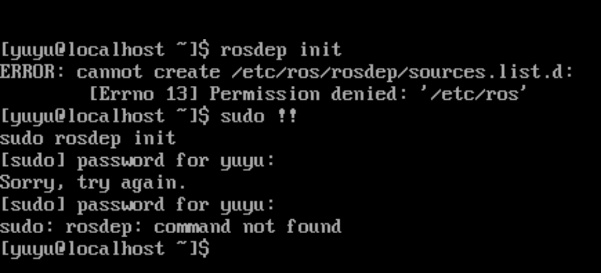

# 在 openEuler 上适配 rosdep

## 什么是 `rosdep`

`rosdep` 是一个可以预先用于为 ros 相关任务预先配置相关环境的工具。

在目前我们的任务（在 openEuler 上适配  `bloom-generate`）上需要先让 `rosdep` 能够在 openEuler 解析相关包依赖，预先配置环境。

## `rosdep` 是怎么工作的

### 系统信息检测

`rosdep` 是依赖系统 `/etc/os-release` 文件去识别目前系统信息，比如说是什么系统，是什么版本等等。

在识别到对应系统后，`rosdep` 会在 `platforms` 文件夹中找相关的配置文件，对应到这个系统的相关信息，如这个系统是使用什么包管理器。

### 依赖安装

在识别相关依赖的时候，`rosdep` 主要是依赖 yaml 文件来获取相关的包依赖关系，并且使用其系统的包管理器为其进行依赖安装。

## 适配 `rosdep`

目前要在 openEuler 适配 `rosdep`，首先需要更改或者新增以下几个文件：

- `__init__.py`
- `Platforms/openeuler.py`
- `rosdistro/rosdep`

## 目前问题

如图，在不使用 `sudo` 时使用 `rosdep init` 指令会提示权限不足，使用了 `sudo` 就会提示无法找到开指令。

根据 `pip show` 指令能够看到这个指令能够正确的被识别，且能正确的输出对应安装路径。

如图在对应路径下使用指令提示找不到对应模块。

且尝试过：

- 使用虚拟环境
- 重新安装

下一步考虑重装系统清除环境，如果还是不行会进一步考虑从源码编译。